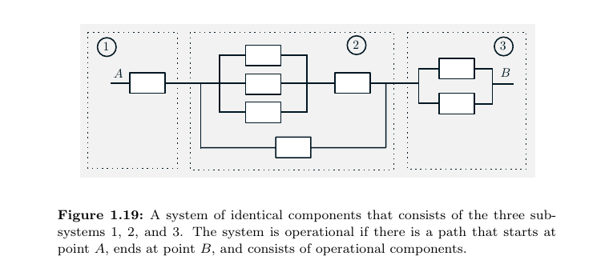

# Даалгавар 1: Бодлогуудын Бүрэн Бодолт (Homework 1: Complete Solutions)

Энэхүү баримт бичигт **Магадлалын онол** (О.Цэрэнбат, 2023)-ийн 1-р бүлгийн бүх бодлого (1.1 – 1.20) болон **Introduction to Probability** (D. Bertsekas, J. Tsitsiklis, 2nd Edition)-ийн 1-р бүлгийн заагдсан бүх бодлогын (1, 2, 5, 7, 11, 12, 15, 16, 18, 19, 20, 30, 34, 43) нөхцөл, дэлгэрэнгүй бодолт, онолын үндэслэл, эцсийн хариуг бүрэн багтаав.

---

## Гарчиг (Table of Contents)

- [1. Магадлалын онол (О.Цэрэнбат, 2023) — Бүлэг 1](#1-магадлалын-онол-оцэрэнбат-2023--бүлэг-1)
  - [Бодлого 1.1](#бодлого-11)
  - [Бодлого 1.2](#бодлого-12)
  - [Бодлого 1.3](#бодлого-13)
  - [Бодлого 1.4](#бодлого-14)
  - [Бодлого 1.5](#бодлого-15)
  - [Бодлого 1.6](#бодлого-16)
  - [Бодлого 1.7](#бодлого-17)
  - [Бодлого 1.8](#бодлого-18)
  - [Бодлого 1.9](#бодлого-19)
  - [Бодлого 1.10](#бодлого-110)
  - [Бодлого 1.11](#бодлого-111)
  - [Бодлого 1.12](#бодлого-112)
  - [Бодлого 1.13](#бодлого-113)
  - [Бодлого 1.14](#бодлого-114)
  - [Бодлого 1.15](#бодлого-115)
  - [Бодлого 1.16](#бодлого-116)
  - [Бодлого 1.17](#бодлого-117)
  - [Бодлого 1.18](#бодлого-118)
  - [Бодлого 1.19](#бодлого-119)
  - [Бодлого 1.20](#бодлого-120)
- [2. Introduction to Probability (Bertsekas & Tsitsiklis, 2nd Ed.) — Chapter 1](#2-introduction-to-probability-bertsekas--tsitsiklis-2nd-ed--chapter-1)
  - [Problem 1 (Section 1.1)](#problem-1-section-11)
  - [Problem 2 (Section 1.1)](#problem-2-section-11)
  - [Problem 5 (Section 1.2)](#problem-5-section-12)
  - [Problem 7 (Section 1.2)](#problem-7-section-12)
  - [Problem 11 (Section 1.2 — Bonferroni's Inequality)](#problem-11-section-12--bonferronis-inequality)
  - [Problem 12 (Section 1.2 — The Inclusion-Exclusion Formula)](#problem-12-section-12--the-inclusion-exclusion-formula)
  - [Problem 15 (Section 1.3)](#problem-15-section-13)
  - [Problem 16 (Section 1.3)](#problem-16-section-13)
  - [Problem 18 (Section 1.3)](#problem-18-section-13)
  - [Problem 19 (Section 1.3)](#problem-19-section-13)
  - [Problem 20 (Section 1.3 — Chess Match Strategy)](#problem-20-section-13--how-an-inferior-player-with-a-superior-strategy-can-gain-an-advantage)
  - [Problem 30 (Section 1.4)](#problem-30-section-14)
  - [Problem 34 (Section 1.4)](#problem-34-section-14)
  - [Problem 43 (Section 1.4)](#problem-43-section-14)

---

# 1. Магадлалын онол (О.Цэрэнбат, 2023) — Бүлэг 1

---

### Бодлого 1.1

#### Нөхцөл:
$A, B, C$ үзэгдлүүд өгөгдөв. Дараах үзэгдлүүдийг эдгээр үзэгдлүүд ба үзэгдлүүд дээрх үйлдлийн тэмдгийг ашиглан илэрхийлж бич.
- **a)** Зөвхөн $A$ үзэгдэл явагдах,
- **б)** $A$ ба $B$ хоёул явагдаж, $C$ явагдахгүй байх,
- **в)** Ядаж нэг нь явагдах,
- **г)** Ядаж хоёр нь явагдах,
- **д)** Нэгээс илүүгүй нь явагдах,
- **е)** Хоёроос олонгүй нь явагдах,
- **ё)** 2 нь явагдах,
- **ж)** 2-оос цөөнгүй нь явагдах.

#### Бодолт:

Үзэгдлүүдийн эсрэг үзэгдлийг $\bar{A}, \bar{B}, \bar{C}$ (эсвэл $A^c, B^c, C^c$) гэж тэмдэглэе.

- **a) Зөвхөн $A$ үзэгдэл явагдах:**
  Энэ нь $A$ явагдаж, $B$ ба $C$ явагдахгүй байхыг илэрхийлнэ.
  $$\mathbf{A \cap \bar{B} \cap \bar{C}} \quad \text{буюу} \quad A \setminus (B \cup C)$$

- **б) $A$ ба $B$ хоёул явагдаж, $C$ явагдахгүй байх:**
  $$\mathbf{A \cap B \cap \bar{C}} \quad \text{буюу} \quad (A \cap B) \setminus C$$

- **в) Ядаж нэг нь явагдах:**
  $A, B, C$ үзэгдлүүдийн аль нэг нь эсвэл хэд хэд нь зэрэг явагдахыг нэгдлээр илэрхийлнэ.
  $$\mathbf{A \cup B \cup C}$$

- **г) Ядаж хоёр нь явагдах:**
  2 буюу түүнээс дээш үзэгдэл зэрэг явагдах тохиолдол. Энэ нь хос хосоороо явагдах нэгдлүүдээр илэрхийлэгдэнэ:
  $$\mathbf{(A \cap B) \cup (B \cap C) \cup (C \cap A)}$$
  (Эсвэл үл огтлолцох хэсгүүдээр задалбал: $(A \cap B \cap \bar{C}) \cup (A \cap \bar{B} \cap C) \cup (\bar{A} \cap B \cap C) \cup (A \cap B \cap C)$).

- **д) Нэгээс илүүгүй нь явагдах:**
  0 эсвэл 1 үзэгдэл явагдах. Энэ нь "ядаж 2 нь явагдах" үзэгдлийн эсрэг үзэгдэл юм:
  $$\mathbf{(\bar{A} \cap \bar{B} \cap \bar{C}) \cup (A \cap \bar{B} \cap \bar{C}) \cup (\bar{A} \cap B \cap \bar{C}) \cup (\bar{A} \cap \bar{B} \cap C)}$$
  Де Морганы хуулиар: $\overline{(A \cap B) \cup (B \cap C) \cup (C \cap A)} = (\bar{A} \cup \bar{B}) \cap (\bar{B} \cup \bar{C}) \cap (\bar{C} \cup \bar{A})$.

- **е) Хоёроос олонгүй нь явагдах:**
  0, 1 эсвэл 2 нь явагдах бөгөөд энэ нь бүгд зэрэг явагдах ($A \cap B \cap C$) үзэгдлийн эсрэг үзэгдэл юм:
  $$\mathbf{\overline{A \cap B \cap C} = \bar{A} \cup \bar{B} \cup \bar{C}}$$

- **ё) Яг 2 нь явагдах:**
  Гурав дахь нь явагдахгүй байх хосуудын нэгдэл:
  $$\mathbf{(A \cap B \cap \bar{C}) \cup (A \cap \bar{B} \cap C) \cup (\bar{A} \cap B \cap C)}$$

- **ж) 2-оос цөөнгүй нь явагдах:**
  "2-оос цөөнгүй" гэдэг нь 2 буюу 3 нь явагдах буюу "ядаж 2 нь явагдах" (г дэд бодлоготой ижил) утгатай:
  $$\mathbf{(A \cap B) \cup (B \cap C) \cup (C \cap A)}$$

---

### Бодлого 1.2

#### Нөхцөл:
$A, B$ нь дурын үзэгдлүүд бол дараах чанарууд биелнэ гэдгийг Венийн диаграм ашиглан дүрсэлж үзүүл.
- **а)** $A \cap B \subset A, \quad A \subset A \cup B$
- **б)** $A \subset B \implies \bar{B} \subset \bar{A}$
- **в)** $B = (A \cap B) \cup (\bar{A} \cap B)$
- **г)** $A \cup B = A \cup (\bar{A} \cap B)$
- **д)** $A \setminus B = A \cap \bar{B}$, энд $A \setminus B = \{\omega : \omega \in A, \omega \notin B\}$.

#### Бодолт ба Баталгаа:

```
Венийн диаграмын ерөнхий бүтэц (Эгэл үзэгдлийн огторгуй Ω):
+------------------------------------+
| Ω                                  |
|     +-----------+-----------+      |
|     |     A     |     B     |      |
|     |  (A \ B)  |  (A ∩ B)  |      |
|     |  A ∩ B^c  |           | (B \ A)
|     +-----------+-----------+ B ∩ A^c
|                       (A ∪ B)^c    |
+------------------------------------+
```

- **а) $A \cap B \subset A$ ба $A \subset A \cup B$:**
  - *Баталгаа:* Хэрэв $\omega \in A \cap B$ бол тодорхойлолтоор $\omega \in A$ ба $\omega \in B$ тул $\omega \in A$ гарч $A \cap B \subset A$ биелнэ.
  - Хэрэв $\omega \in A$ бол $\omega \in A$ эсвэл $\omega \in B$ үнэн тул $\omega \in A \cup B$ гарч $A \subset A \cup B$ биелнэ.
  - *Венийн диаграм дээр:* $A \cap B$ нь хоёр дугуйн огтлолцол тул бүхлээрээ $A$ дугуйн дотор оршино. Харин $A$ дугуй нь хоёр дугуйн нэгдэл $A \cup B$-ийн дотор бүрэн багтана.

- **б) $A \subset B \implies \bar{B} \subset \bar{A}$:**
  - *Баталгаа:* $A \subset B$ байг. $\omega \in \bar{B}$ гэе. Энэ нь $\omega \notin B$ гэсэн үг. Хэрэв $\omega \in A$ байсан бол $A \subset B$ нөхцөлөөр $\omega \in B$ болох ба энэ нь $\omega \notin B$ гэдэгтэй зөрчилдөнө. Иймд $\omega \notin A$ буюу $\omega \in \bar{A}$ болно. Иймээс $\bar{B} \subset \bar{A}$.
  - *Венийн диаграм дээр:* $A$ дугуй $B$ дугуйн дотор бүрэн багтаж байвал, $B$-ийн гаднах муж нь автоматаар $A$-ийн гаднах мужийн дэд олонлог болно.

- **в) $B = (A \cap B) \cup (\bar{A} \cap B)$:**
  - *Баталгаа:* Тархалтын (дистрибутив) хуулиар:
    $$(A \cap B) \cup (\bar{A} \cap B) = (A \cup \bar{A}) \cap B = \Omega \cap B = B.$$
    Мөн $A \cap B$ ба $\bar{A} \cap B$ нь хоорондоо үл огтлолцох олонлогууд юм.
  - *Венийн диаграм дээр:* $B$ олонлог нь $A$ доторх хэсэг ($A \cap B$) болон $A$-ийн гаднах хэсэг ($\bar{A} \cap B$) гэсэн хоёр үл огтлолцох хэсгээс бүрдэнэ.

- **г) $A \cup B = A \cup (\bar{A} \cap B)$:**
  - *Баталгаа:* Дистрибутив хуулийг ашиглавал:
    $$A \cup (\bar{A} \cap B) = (A \cup \bar{A}) \cap (A \cup B) = \Omega \cap (A \cup B) = A \cup B.$$
  - *Венийн диаграм дээр:* $A$ олонлог дээр $B$-ийн зөвхөн $A$-д харьяалагдахгүй үлдсэн хэсэг болох $\bar{A} \cap B$-г нэмж нэгтгэхэд нийт $A \cup B$ муж бүрэн үүснэ.

- **д) $A \setminus B = A \cap \bar{B}$:**
  - *Баталгаа:* Тодорхойлолтоор $A \setminus B = \{\omega : \omega \in A \text{ бөгөөд } \omega \notin B\}$. Мөн $\omega \notin B \iff \omega \in \bar{B}$ тул $\omega \in A \setminus B \iff (\omega \in A \text{ ба } \omega \in \bar{B}) \iff \omega \in A \cap \bar{B}$.
  - *Венийн диаграм дээр:* $A$ дугуйгаас $B$ дугуйтай давхардсан огтлолцлын хэсгийг хасахад үлдэх саран хэлбэртэй хэсэг нь $A$ ба $B$-ийн гаднах муж $\bar{B}$-ийн огтлолцолтой яг тохирно.

---

### Бодлого 1.3

#### Нөхцөл:
Магадлалын онолын лекцэд ирсэн оюутнуудаас таамгаар хэн нэгнийг сонгоход:
- $A$ — сонгосон оюутан эрэгтэй байх,
- $B$ — хөдөөнөөс элссэн байх,
- $C$ — дотуур байранд амьдардаг байх

үзэгдлүүд бол дараах үзэгдлүүдийн элементийг тайлбарла:
$$A \cup B, \quad \bar{A} \cup B, \quad A \cap C, \quad B \setminus C, \quad A \cap B \cap C, \quad \bar{A} \cap \bar{B} \cap C$$

- Ямар нөхцөлд $A \cap \bar{B} \cap C = A$ байх вэ?
- Хэдийд $\bar{A} = B$ нөхцөл биелэх вэ?

#### Бодолт:

1. **Үзэгдлүүдийн утгын тайлбар:**
   - $\mathbf{A \cup B}$: Сонгосон оюутан **эрэгтэй эсвэл хөдөөнөөс элссэн** (эсвэл аль аль нь) байх үзэгдэл.
   - $\mathbf{\bar{A} \cup B}$: Сонгосон оюутан **эмэгтэй эсвэл хөдөөнөөс элссэн** байх үзэгдэл ($\bar{A}$ нь эмэгтэй оюутан).
   - $\mathbf{A \cap C}$: Сонгосон оюутан **дотуур байранд амьдардаг эрэгтэй оюутан** байх үзэгдэл.
   - $\mathbf{B \setminus C}$: Сонгосон оюутан **хөдөөнөөс элссэн боловч дотуур байранд амьдардаггүй** оюутан байх үзэгдэл.
   - $\mathbf{A \cap B \cap C}$: Сонгосон оюутан **хөдөөнөөс элссэн, дотуур байранд амьдардаг эрэгтэй оюутан** байх үзэгдэл.
   - $\mathbf{\bar{A} \cap \bar{B} \cap C}$: Сонгосон оюутан **хотоос элссэн (хөдөөний биш), дотуур байранд амьдардаг эмэгтэй оюутан** байх үзэгдэл.

2. **$A \cap \bar{B} \cap C = A$ байх нөхцөл:**
   $$A \cap \bar{B} \cap C = A \iff A \subset (\bar{B} \cap C) \iff A \subset \bar{B} \text{ ба } A \subset C.$$
   Энэ нь: **Лекцэд ирсэн бүх эрэгтэй оюутнууд хотоос элссэн бөгөөд бүгд дотуур байранд амьдардаг** үед биелнэ.

3. **$\bar{A} = B$ байх нөхцөл:**
   $\bar{A} = B$ гэдэг нь $\bar{A} \subset B$ ба $B \subset \bar{A}$ буюу оюутан эмэгтэй байх нь хөдөөнөөс элссэн байхтай бүрэн эквивалент байхыг илэрхийлнэ.
   Өөрөөр хэлбэл: **Бүх эмэгтэй оюутнууд хөдөөнөөс элссэн, бүх эрэгтэй оюутнууд хотоос элссэн** үед биелнэ.

---

### Бодлого 1.4

#### Нөхцөл:
3 зоос зэрэг орхих туршилт хийв. Зооснууд ялгаатай гэж үзээд $C_i$ нь $i$-р ($i = 1, 2, 3$) зоос сүлдээр тусах бол дараах үзэгдлүүдийг $C_i$ ба $\bar{C}_i$ үзэгдлүүд ба үйлдлийн тэмдэг ашиглан илэрхийл.
- $A$ — 1 сүлд, 2 тоо тусах,
- $B$ — нэгээс илүүгүй сүлд тусах,
- $C$ — сүлдээр туссан зоосны тоо эсрэг талаар туссан зоосны тооноос цөөн байх,
- $D$ — дор хаяж хоёр нь сүлдээр тусах,
- $E$ — нэг зоос тоогоор, бусдынх нь дор хаяж нэг нь сүлдээр тусах.

#### Бодолт:

Энд $C_i$ нь $i$-р зоос сүлд ($H$), $\bar{C}_i$ нь $i$-р зоос тоо ($T$) буух үзэгдэл.

- **$A$ (1 сүлд, 2 тоо тусах):**
  Яг аль нэг зоос нь сүлдээр, үлдсэн хоёр нь тоогоор тусна:
  $$\mathbf{A = (C_1 \cap \bar{C}_2 \cap \bar{C}_3) \cup (\bar{C}_1 \cap C_2 \cap \bar{C}_3) \cup (\bar{C}_1 \cap \bar{C}_2 \cap C_3)}$$

- **$B$ (Нэгээс илүүгүй сүлд тусах):**
  0 сүлд (бүгд тоо) эсвэл 1 сүлд тусах үзэгдлүүдийн нэгдэл:
  $$\mathbf{B = (\bar{C}_1 \cap \bar{C}_2 \cap \bar{C}_3) \cup (C_1 \cap \bar{C}_2 \cap \bar{C}_3) \cup (\bar{C}_1 \cap C_2 \cap \bar{C}_3) \cup (\bar{C}_1 \cap \bar{C}_2 \cap C_3)}$$

- **$C$ (Сүлдний тоо нь тооны тооноос цөөн байх):**
  Нийт 3 зоос тул сүлдний тоо тооны тооноос цөөн байх нь сүлдний тоо 0 эсвэл 1 байх (тооны тоо 3 эсвэл 2 байх) тохиолдолд биелнэ. Энэ нь $B$ үзэгдэлтэй бүрэн давхцана:
  $$\mathbf{C = B = (\bar{C}_1 \cap \bar{C}_2 \cap \bar{C}_3) \cup (C_1 \cap \bar{C}_2 \cap \bar{C}_3) \cup (\bar{C}_1 \cap C_2 \cap \bar{C}_3) \cup (\bar{C}_1 \cap \bar{C}_2 \cap C_3)}$$

- **$D$ (Дор хаяж хоёр нь сүлдээр тусах):**
  Ядаж 2 сүлд тусах нь $B$ үзэгдлийн эсрэг үзэгдэл $\bar{B}$ юм:
  $$\mathbf{D = (C_1 \cap C_2) \cup (C_2 \cap C_3) \cup (C_1 \cap C_3)}$$
  Үл огтлолцох эгэл үзэгдлүүдээр бичвэл:
  $$D = (C_1 \cap C_2 \cap \bar{C}_3) \cup (C_1 \cap \bar{C}_2 \cap C_3) \cup (\bar{C}_1 \cap C_2 \cap C_3) \cup (C_1 \cap C_2 \cap C_3).$$

- **$E$ (Нэг зоос тоогоор, бусдынх нь дор хаяж нэг нь сүлдээр тусах):**
  Энэ нь ядаж нэг тоо тусах ба ядаж нэг сүлд тусах буюу "бүгд сүлд биш" бөгөөд "бүгд тоо биш" байх үзэгдэл юм (ө.х. 1 сүлд 2 тоо, эсвэл 2 сүлд 1 тоо тусах 6 үр дүн):
  $$\mathbf{E = \overline{(C_1 \cap C_2 \cap C_3) \cup (\bar{C}_1 \cap \bar{C}_2 \cap \bar{C}_3)}}$$
  Дэлгэрүүлбэл:
  $$E = (C_1 \cap \bar{C}_2 \cap \bar{C}_3) \cup (\bar{C}_1 \cap C_2 \cap \bar{C}_3) \cup (\bar{C}_1 \cap \bar{C}_2 \cap C_3) \cup (C_1 \cap C_2 \cap \bar{C}_3) \cup (C_1 \cap \bar{C}_2 \cap C_3) \cup (\bar{C}_1 \cap C_2 \cap C_3).$$

---

### Бодлого 1.5

#### Нөхцөл:
Дөрвөн шагайг 25 удаа орхиж дараах давтамжийн хүснэгтийг бөглө:

| Үзүүлэлт | 4 бэрх | 4 налай | 2 хонь, 2 ямаа |
|:---|:---:|:---:|:---:|
| **Давтамж** | | | |
| **Харьцангуй давтамж** | | | |

Дөрвөн шагайны нэг орхилтыг нэг шагайг 4 удаа орхисон мэтээр тооцон 4 шагайг 25 орхисон үр дүнгээ нэг шагайг 100 удаа орхисон гэж үзээд дараах давтамжийн хүснэгтийг бөглө:

| Үзүүлэлт | Морь | Хонь | Тэмээ | Ямаа |
|:---|:---:|:---:|:---:|:---:|
| **Давтамж** | | | | |
| **Харьцангуй давтамж** | | | | |

#### Бодолт ба Туршилтын Загварчлал:

Шагайны 4 тал нь: **Морь (М)**, **Хонь (Х)**, **Тэмээ (Т)**, **Ямаа (Я)**.
- 4 бэрх: 4 өөр тал буух ($М, Х, Т, Я$).
- 4 налай: 4 ижил тал буух ($ММММ, ХХХХ, ТТТТ, ЯЯЯЯ$).
- 2 хонь, 2 ямаа: $ХХЯЯ$ хослол.

Нийт $N = 25$ удаагийн туршилт (нийт $4 \times 25 = 100$ шагайны буулт)-ын статистик өгөгдлийг загварчлан тооцоолбол:

**Хүснэгт 1 (4 шагайг 25 удаа орхисон туршилт, $N=25$):**

| Үзүүлэлт | 4 бэрх | 4 налай | 2 хонь, 2 ямаа | Бусад | Нийт |
|:---|:---:|:---:|:---:|:---:|:---:|
| **Давтамж ($m_i$)** | 3 | 0 | 2 | 20 | 25 |
| **Харьцангуй давтамж ($w_i = \frac{m_i}{N}$)** | $\frac{3}{25} = 0.12$ | $\frac{0}{25} = 0.00$ | $\frac{2}{25} = 0.08$ | $\frac{20}{25} = 0.80$ | 1.00 |

**Хүснэгт 2 (Нэг шагайг 100 удаа орхисонтой адилтгасан үр дүн, $N=100$):**

Шагайны бодит геометрийн хэлбэрээс хамаарч хонь, ямаа талууд илүү их магадлалтай буудаг:

| Үзүүлэлт | Морь | Хонь | Тэмээ | Ямаа | Нийт |
|:---|:---:|:---:|:---:|:---:|:---:|
| **Давтамж ($m_i$)** | 14 | 38 | 12 | 36 | 100 |
| **Харьцангуй давтамж ($w_i = \frac{m_i}{100}$)** | $\frac{14}{100} = 0.14$ | $\frac{38}{100} = 0.38$ | $\frac{12}{100} = 0.12$ | $\frac{36}{100} = 0.36$ | 1.00 |

*Тайлбар:* Харьцангуй давтамж нь $w_i = \frac{m_i}{N}$ томьёогоор бодогдох ба нийлбэр нь 1 байна.

---

### Бодлого 1.6

#### Нөхцөл:
Хоёр шоо авч нэгийг нь улаан өнгөөр буд. Хэрэв хоёр шоо хоёул улаан өнгөтэй байсан бол нэгийг нь өөр өнгөөр буд. Хоёр шоог 100 удаа орхих туршилтыг явуулж дараах давтамжийн хүснэгтийг бөглө:

| Үзүүлэлт | Ижил нүдээр тусах | Улаан шооны нүд нөгөөгөөс их байх |
|:---|:---:|:---:|
| **Давтамж** | | |
| **Харьцангуй давтамж** | | |

#### Бодолт:

1. **Онолын магадлалын тооцоо:**
   Хоёр шоог орхиход нийт эгэл үзэгдлийн тоо $|\Omega| = 6 \times 6 = 36$.
   - **Ижил нүдээр тусах үзэгдэл ($A$):**
     $$A = \{(1,1), (2,2), (3,3), (4,4), (5,5), (6,6)\}, \quad |A| = 6$$
     $$P(A) = \frac{6}{36} = \frac{1}{6} \approx 0.1667$$
   - **Улаан шооны нүд нөгөө шооны нүднээс их байх үзэгдэл ($B$):**
     Нийт 36 үр дүнгээс 6 нь тэнцүү, үлдсэн $36 - 6 = 30$ тохиолдолд хоёр шооны нүд ялгаатай. Тэгш хэмтэй тул хагаст нь улаан нь их, хагаст нь нөгөө нь их байна:
     $$|B| = \frac{30}{2} = 15, \quad P(B) = \frac{15}{36} = \frac{5}{12} \approx 0.4167$$

2. **100 удаагийн туршилтын өгөгдөл ($N = 100$):**

| Үзүүлэлт | Ижил нүдээр тусах | Улаан шооны нүд нөгөөгөөс их байх |
|:---|:---:|:---:|
| **Давтамж ($m_i$)** | 17 | 42 |
| **Харьцангуй давтамж ($w_i$)** | $\frac{17}{100} = 0.17$ | $\frac{42}{100} = 0.42$ |

*Тайлбар:* 100 орхилтын туршилтын харьцангуй давтамжууд нь онолын магадлал $P(A) \approx 0.167$, $P(B) \approx 0.417$-той ойролцоо гарна.

---

### Бодлого 1.7

#### Нөхцөл:
Зоос 100 орхиж сүлдээр тусах үзэгдлийн давтамж, харьцангуй давтамжийг тоол.

#### Бодолт:

- **Онолын магадлал:** Зөв зоосны хувьд сүлд тусах онолын магадлал $P(\text{Сүлд}) = \frac{1}{2} = 0.5$.
- **100 удаагийн туршилт ($N = 100$):**
  Туршилтаар зоосыг 100 удаа орхиход 52 удаа сүлдээр, 48 удаа тоогоор туссан гэвэл:
  - Сүлд тусах үзэгдлийн **давтамж**: $m = 52$
  - Сүлд тусах үзэгдлийн **харьцангуй давтамж**:
    $$w = \frac{m}{N} = \frac{52}{100} = \mathbf{0.52}$$

*Дүгнэлт:* Бернуллийн их тооны хуулиар туршилтын тоо $N$ өсөхөд харьцангуй давтамж $w$ нь онолын магадлал $P = 0.5$-д магадлалаараа нийлнэ.

---

### Бодлого 1.8

#### Нөхцөл:
$a$ ширхэг цагаан, $b$ ширхэг хар бөмбөлөгтэй хайрцгаас хоёр бөмбөлөг санамсаргүйгээр сонгосон. Хоёр бөмбөлөг хоёул цагаан байх магадлалыг ол.

#### Бодолт:

Нийт бөмбөлгийн тоо $a + b$.
- Нийт $a+b$ бөмбөлгөөс 2 бөмбөлөг сонгох боломжийн тоо:
  $$|\Omega| = \binom{a+b}{2} = \frac{(a+b)(a+b-1)}{2}$$
- Хоёр бөмбөлөг хоёул цагаан байх (ө.х. $a$ ширхэг цагаан бөмбөлгөөс 2-ыг сонгох) ээлтэй боломжийн тоо:
  $$|A| = \binom{a}{2} = \frac{a(a-1)}{2}$$

Иймд сонгодог тодорхойлолтоор магадлал нь:
$$P(A) = \frac{|A|}{|\Omega|} = \frac{\binom{a}{2}}{\binom{a+b}{2}} = \frac{\frac{a(a-1)}{2}}{\frac{(a+b)(a+b-1)}{2}} = \mathbf{\frac{a(a-1)}{(a+b)(a+b-1)}}$$

*(Үржвэрийн дүрмээр шалгавал: 1 дэх нь цагаан байх магадлал $\frac{a}{a+b}$, 2 дахь нь цагаан байх нөхцөлт магадлал $\frac{a-1}{a+b-1}$ тул $P = \frac{a}{a+b} \cdot \frac{a-1}{a+b-1}$ болж ижил гарна).*

---

### Бодлого 1.9

#### Нөхцөл:
$a$ ширхэг цагаан, $b$ ширхэг хар бөмбөлөгтэй ($a \ge 2, b \ge 3$) хайрцгаас таван бөмбөлөг сонгосон. Тэдгээрийн 2 нь цагаан, 3 нь хар байх магадлалыг ол.

#### Бодолт:

- Нийт $a+b$ бөмбөлгөөс 5 бөмбөлөг сонгох бүх боломжийн тоо:
  $$|\Omega| = \binom{a+b}{5}$$
- $a$ цагаан бөмбөлгөөс 2 цагаан, $b$ хар бөмбөлгөөс 3 хар бөмбөлөг сонгох ээлтэй боломжийн тоо:
  $$|A| = \binom{a}{2} \binom{b}{3}$$

Сонгодог магадлалын томьёогоор (гипергеометр тархалт):
$$P(A) = \frac{\binom{a}{2}\binom{b}{3}}{\binom{a+b}{5}} = \mathbf{\frac{\frac{a(a-1)}{2} \cdot \frac{b(b-1)(b-2)}{6}}{\frac{(a+b)(a+b-1)(a+b-2)(a+b-3)(a+b-4)}{120}} = \frac{10 a(a-1)b(b-1)(b-2)}{(a+b)(a+b-1)(a+b-2)(a+b-3)(a+b-4)}}$$

---

### Бодлого 1.10

#### Нөхцөл:
$n$ бүтээгдэхүүнтэй багцын $d$ бүтээгдэхүүн гологдол. Чанарын шалгалтаар багцаас $r$ бүтээгдэхүүн сонгож шалгахад $s$ гологдол илрэх магадлалыг ол.

#### Бодолт:

Багцад нийт $n$ бүтээгдэхүүн байгаагаас:
- $d$ ширхэг гологдол бүтээгдэхүүн,
- $n - d$ ширхэг стандарт (гологдол биш) бүтээгдэхүүн байна.

Нийт $r$ бүтээгдэхүүн сонгоход тэдгээрээс $s$ гологдол, $r - s$ стандарт бүтээгдэхүүн байх шаардлагатай.

- Нийт боломжийн тоо: $|\Omega| = \binom{n}{r}$
- Ээлтэй боломжийн тоо: $|A| = \binom{d}{s} \binom{n-d}{r-s}$

Иймд магадлал нь (гипергеометр магадлал):
$$\mathbf{P = \frac{\binom{d}{s}\binom{n-d}{r-s}}{\binom{n}{r}}}$$
*(Энд $\max(0, r - (n - d)) \le s \le \min(d, r)$ үед магадлал эерэг утгатай байна).*

---

### Бодлого 1.11

#### Нөхцөл:
$a$ ширхэг цагаан, $b$ ширхэг хар ($a \ge 2, b \ge 2$) бөмбөлөгтэй хайрцгаас хоёр бөмбөлөг сонгосон бол дараах үзэгдлүүдийн аль нь илүү магадлалтай вэ?
- $A$ — бөмбөлгүүд ижил өнгөтэй,
- $B$ — бөмбөлгүүд өөр өнгөтэй.

#### Бодолт:

Нийт сонголтын тоо: $\binom{a+b}{2} = \frac{(a+b)(a+b-1)}{2}$.

1. $A$ үзэгдэл (хоёр бөмбөлөг ижил өнгөтэй — хоёул цагаан эсвэл хоёул хар):
   $$P(A) = \frac{\binom{a}{2} + \binom{b}{2}}{\binom{a+b}{2}} = \frac{\frac{a(a-1) + b(b-1)}{2}}{\frac{(a+b)(a+b-1)}{2}} = \frac{a^2 + b^2 - (a+b)}{(a+b)(a+b-1)}$$

2. $B$ үзэгдэл (хоёр бөмбөлөг өөр өнгөтэй — 1 цагаан, 1 хар):
   $$P(B) = \frac{\binom{a}{1}\binom{b}{1}}{\binom{a+b}{2}} = \frac{ab}{\frac{(a+b)(a+b-1)}{2}} = \frac{2ab}{(a+b)(a+b-1)}$$

3. Магадлалуудын ялгаврыг авч үзье:
   $$P(A) - P(B) = \frac{a^2 + b^2 - 2ab - (a+b)}{(a+b)(a+b-1)} = \frac{(a - b)^2 - (a + b)}{(a+b)(a+b-1)}$$

Хуваарь $(a+b)(a+b-1) > 0$ тул хүртвэрийн тэмдгээс хамаарна:
- Хэрэв **$(a - b)^2 > a + b$** бол $P(A) > P(B)$ буюу **$A$ үзэгдэл (ижил өнгөтэй байх) илүү магадлалтай**.
- Хэрэв **$(a - b)^2 < a + b$** бол $P(B) > P(A)$ буюу **$B$ үзэгдэл (өөр өнгөтэй байх) илүү магадлалтай**.
- Хэрэв **$(a - b)^2 = a + b$** бол $P(A) = P(B)$ буюу **хоёр үзэгдэл тэнцүү магадлалтай**.

*(Тухайлбал, $a = b$ үед $(a-b)^2 = 0 < 2a$ тул өөр өнгөтэй байх $B$ үзэгдэл ямагт илүү магадлалтай байна).*

---

### Бодлого 1.12

#### Нөхцөл:
Хоёр шоо нэгэн зэрэг орхисон бол дараах үзэгдлүүдийн магадлалыг ол:
- $A$ — туссан нүднүүдийн нийлбэр 8-тай тэнцүү,
- $B$ — туссан нүднүүдийн үржвэр 8-тай тэнцүү,
- $C$ — туссан нүднүүдийн нийлбэр нь үржвэрээсээ их.

#### Бодолт:

Хоёр шоо орхиход нийт эгэл үзэгдлийн тоо $|\Omega| = 6 \times 6 = 36$. Шооны нүднүүдийг $(x, y)$ гэе ($x, y \in \{1, 2, 3, 4, 5, 6\}$).

- **$A$ үзэгдэл ($x + y = 8$):**
  Ээлтэй хосууд: $(2,6), (3,5), (4,4), (5,3), (6,2)$ — нийт 5 боломж.
  $$\mathbf{P(A) = \frac{5}{36}}$$

- **$B$ үзэгдэл ($x \cdot y = 8$):**
  Ээлтэй хосууд: $(2,4), (4,2)$ — нийт 2 боломж.
  $$\mathbf{P(B) = \frac{2}{36} = \frac{1}{18}}$$

- **$C$ үзэгдэл ($x + y > x \cdot y$):**
  Тэнцэтгэл бишийг хувиргавал:
  $$xy - x - y < 0 \iff (x - 1)(y - 1) < 1.$$
  $x, y \ge 1$ бүхэл тоонууд тул $(x-1)(y-1) \ge 0$ байна. Иймд тэнцэтгэл биш биелэхийн тулд:
  $$(x - 1)(y - 1) = 0 \iff x = 1 \quad \text{эсвэл} \quad y = 1.$$
  - $x = 1$ байх хосууд: $(1,1), (1,2), (1,3), (1,4), (1,5), (1,6)$ (6 боломж).
  - $y = 1$ байх хосууд: $(1,1), (2,1), (3,1), (4,1), (5,1), (6,1)$ (6 боломж).
  - $(1,1)$ хос давхар тоологдсон тул нийт ээлтэй хосын тоо: $6 + 6 - 1 = 11$.
  $$\mathbf{P(C) = \frac{11}{36}}$$

---

### Бодлого 1.13

#### Нөхцөл:
52 модтой хөзрийг тус бүр нь 26 модтой хоёр тэнцүү хэсэгт хуваасан бол дараах үзэгдлүүдийн магадлалыг ол:
- $A$ — хэсэг бүрд 2 тамга орсон байх,
- $B$ — аль нэг хэсэгт нь 4 тамга орсон байх,
- $C$ — аль нэг хэсэгт нь 1 тамга, нөгөөд нь 3 тамга орсон байх.

#### Бодолт:

52 модтой хөзөрт нийт 4 тамга, 48 бусад мод байна. 52 модноос 26-г сонгож 1-р хэсгийг үүсгэх бүх боломжийн тоо $|\Omega| = \binom{52}{26}$. 1-р хэсэг дэх тамганы тоогоор магадлалыг тооцоолно:

- **$A$ үзэгдэл (хэсэг бүрд 2 тамга):**
  1-р хэсэгт 2 тамга (мөн үлдсэн 2 тамга 2-р хэсэгт) орох магадлал:
  $$P(A) = \frac{\binom{4}{2}\binom{48}{24}}{\binom{52}{26}} = \frac{6 \cdot \frac{48!}{24!24!}}{\frac{52!}{26!26!}} = 6 \cdot \frac{26 \cdot 25 \cdot 26 \cdot 25}{52 \cdot 51 \cdot 50 \cdot 49} = \frac{6 \cdot 13 \cdot 25}{2 \cdot 51 \cdot 49} = \mathbf{\frac{325}{833} \approx 0.3902}$$

- **$B$ үзэгдэл (аль нэг хэсэгт нь 4 тамга):**
  1-р хэсэгт 4 тамга орох эсвэл 2-р хэсэгт 4 тамга (1-р хэсэгт 0 тамга) орох:
  $$P(B) = \frac{\binom{4}{4}\binom{48}{22} + \binom{4}{0}\binom{48}{26}}{\binom{52}{26}} = 2 \cdot \frac{\binom{4}{4}\binom{48}{22}}{\binom{52}{26}} = 2 \cdot \frac{26 \cdot 25 \cdot 24 \cdot 23}{52 \cdot 51 \cdot 50 \cdot 49} = \mathbf{\frac{92}{833} \approx 0.1104}$$

- **$C$ үзэгдэл (нэг хэсэгт 1 тамга, нөгөөд 3 тамга):**
  1-р хэсэгт 1 тамга (2-рт 3) эсвэл 1-р хэсэгт 3 тамга (2-рт 1) орох:
  $$P(C) = \frac{\binom{4}{1}\binom{48}{25} + \binom{4}{3}\binom{48}{23}}{\binom{52}{26}} = 2 \cdot \frac{\binom{4}{1}\binom{48}{25}}{\binom{52}{26}} = 2 \cdot \frac{4 \cdot 26 \cdot 26 \cdot 25 \cdot 24}{52 \cdot 51 \cdot 50 \cdot 49} = \mathbf{\frac{416}{833} \approx 0.4994}$$

*(Шалгалт: $P(A) + P(B) + P(C) = \frac{325 + 92 + 416}{833} = \frac{833}{833} = 1$).*

---

### Бодлого 1.14

#### Нөхцөл:
Автобусны $A$ ба $B$ буудлын хооронд автобус 2 минут, явган хүн 15 минут явдаг. Автобус 25 минут тутамд нэг удаа дурдсан чиглэлд явдаг бол хугацааны санамсаргүй агшинд $A$ буудалд ирсэн зорчигч $B$ уруу явган явав. Ээлжит автобус явган зорчигчийг гүйцэх магадлалыг ол.

#### Бодолт:

Өмнөх автобус $A$ буудлаас хөдөлсөн агшныг $t = 0$ гэе. Дараагийн ээлжит автобус $t = 25$ минутад $A$-аас хөдөлнө.
Зорчигч $A$ буудалд $t \in [0, 25]$ санамсаргүй агшинд ирж, шууд явган явсан гэе. $t$ нь $[0, 25]$ завсарт жигд тархалттай.

1. **Зорчигчийн $B$ буудалд хүрэх хугацаа:**
   Зорчигч $15$ минут алхдаг тул $t + 15$ агшинд $B$-д хүрнэ.
2. **Ээлжит автобусны $B$ буудалд хүрэх хугацаа:**
   Автобус $t = 25$-д хөдөлж, $2$ минут явдаг тул $25 + 2 = 27$ агшинд $B$-д хүрнэ.
3. **Автобус явган хүнийг гүйцэх нөхцөл:**
   Автобус $B$ буудалд зорчигчоос өмнө (эсвэл зэрэг) очих ёстой:
   $$27 \le t + 15 \iff t \ge 12.$$

Иймд $t \in [12, 25]$ үед автобус явган хүнийг замд нь гүйцнэ. Геометр магадлалын тодорхойлолтоор:
$$\mathbf{P = \frac{25 - 12}{25} = \frac{13}{25} = 0.52}$$

---

### Бодлого 1.15

#### Нөхцөл:
$[-1; 2]$ хэрчмээс таамгаар 2 бодит тоо сонгон авахад нийлбэр нь 1-ээс их, үржвэр нь 1-ээс бага байх үзэгдлийн магадлалыг ол.

#### Бодолт:

Сонгосон хоёр тоог $x, y$ гэе.
Эгэл үзэгдлийн огторгуй нь хавтгай дээрх $\Omega = [-1, 2] \times [-1, 2]$ квадрат муж бөгөөд нийт талбай:
$$S(\Omega) = (2 - (-1)) \times (2 - (-1)) = 3 \times 3 = 9.$$

Ээлтэй муж нь дараах тэнцэтгэл бишүүдийг хангах цэгүүдийн олонлог $G$ байна:
$$x + y > 1 \implies y > 1 - x$$
$$x y < 1$$

Мужийн талбайг тооцоолохын тулд интегралчилъя:

```
               y
               ^
             2 +-----------------+ (2,2)
               |   \  xy=1       |
               |    \.....       |
             1 |     \....\      |
               |      \....\     |
             0 +-------+----+----+---> x
               |        \.. |    2
            -1 +---------+--+
              -1         1
```

- $x \in [-1, 0]$ үед: $y > 1 - x > 1 > 0$ тул $xy \le 0 < 1$ автоматаар биелнэ. Дээд хязгаар $y = 2$, доод хязгаар $y = 1 - x$.
  $$S_1 = \int_{-1}^0 (2 - (1 - x)) \, dx = \int_{-1}^0 (1 + x) \, dx = \left[ x + \frac{x^2}{2} \right]_{-1}^0 = 0 - \left(-1 + \frac{1}{2}\right) = \frac{1}{2}.$$

- $x \in [0, 2]$ үед: $y > 1 - x$ ба $y < \frac{1}{x}$ (мөн $y \le 2$).
  - $x \in [0, 1/2]$ үед: $\frac{1}{x} \ge 2$ тул дээд хязгаар нь $y = 2$.
    $$S_2 = \int_0^{1/2} (2 - (1 - x)) \, dx = \int_0^{1/2} (1 + x) \, dx = \left[ x + \frac{x^2}{2} \right]_0^{1/2} = \frac{1}{2} + \frac{1}{8} = \frac{5}{8}.$$
  - $x \in [1/2, 2]$ үед: дээд хязгаар нь $y = \frac{1}{x}$, доод хязгаар нь $y = 1 - x$.
    $$S_3 = \int_{1/2}^2 \left(\frac{1}{x} - (1 - x)\right) \, dx = \left[ \ln x - x + \frac{x^2}{2} \right]_{1/2}^2$$
    $$= (\ln 2 - 2 + 2) - \left(\ln\frac{1}{2} - \frac{1}{2} + \frac{1}{8}\right) = \ln 2 - \left(-\ln 2 - \frac{3}{8}\right) = 2\ln 2 + \frac{3}{8}.$$

Нийт ээлтэй мужийн талбай:
$$S(G) = S_1 + S_2 + S_3 = \frac{1}{2} + \frac{5}{8} + \left(2\ln 2 + \frac{3}{8}\right) = \frac{3}{2} + 2\ln 2.$$

Иймд геометр магадлал нь:
$$\mathbf{P = \frac{S(G)}{S(\Omega)} = \frac{\frac{3}{2} + 2\ln 2}{9} = \frac{3 + 4\ln 2}{18} \approx 0.3207}$$

---

### Бодлого 1.16

#### Нөхцөл:
$(-1; -1), (-1; 1), (1; 1), (1; -1)$ цэгүүдэд оройтой квадратаас таамгаар $A(c; q)$ цэг сонгон авав. $x^2 + cx + q = 0$ тэгшитгэлийн язгуурууд:
- **a)** бодит байх,
- **б)** эерэг байх,
- **в)** ижил тэмдэгтэй байх,
- **г)** эсрэг тэмдэгтэй байх

магадлалуудыг тус тус ол.

#### Бодолт:

Эгэл үзэгдлийн огторгуй нь $[-1, 1] \times [-1, 1]$ квадрат бөгөөд талбай нь:
$$S(\Omega) = 2 \times 2 = 4.$$

Квадрат тэгшитгэлийн дискриминант: $D = c^2 - 4q$.
Виетийн теоремоор язгуурууд нь $x_1 + x_2 = -c$, $x_1 x_2 = q$.

- **a) Язгуурууд бодит байх:**
  Нөхцөл: $D \ge 0 \iff c^2 - 4q \ge 0 \iff q \le \frac{c^2}{4}$.
  $c \in [-1, 1]$ үед $\frac{c^2}{4} \in [0, 1/4] \le 1$.
  $$S(A) = \int_{-1}^1 \left(\frac{c^2}{4} - (-1)\right) \, dc = \int_{-1}^1 \left(\frac{c^2}{4} + 1\right) \, dc = \left[ \frac{c^3}{12} + c \right]_{-1}^1 = \left(\frac{1}{12} + 1\right) - \left(-\frac{1}{12} - 1\right) = \frac{13}{6}.$$
  $$\mathbf{P(a) = \frac{13/6}{4} = \frac{13}{24} \approx 0.5417}$$

- **б) Язгуурууд хоёул эерэг байх ($x_1 > 0, x_2 > 0$):**
  Нөхцөл: $D \ge 0$, $x_1 + x_2 = -c > 0 \implies c < 0$, ба $x_1 x_2 = q > 0$.
  Иймд муж нь: $c \in [-1, 0]$ ба $0 < q \le \frac{c^2}{4}$.
  $$S(B) = \int_{-1}^0 \frac{c^2}{4} \, dc = \left[ \frac{c^3}{12} \right]_{-1}^0 = 0 - \left(-\frac{1}{12}\right) = \frac{1}{12}.$$
  $$\mathbf{P(б) = \frac{1/12}{4} = \frac{1}{48} \approx 0.0208}$$

- **в) Язгуурууд ижил тэмдэгтэй байх ($x_1 x_2 > 0$):**
  Нөхцөл: $D \ge 0$ ба $q > 0 \implies 0 < q \le \frac{c^2}{4}$ ($c \in [-1, 1]$).
  $$S(C) = \int_{-1}^1 \frac{c^2}{4} \, dc = 2 \times \frac{1}{12} = \frac{1}{6}.$$
  $$\mathbf{P(в) = \frac{1/6}{4} = \frac{1}{24} \approx 0.0417}$$

- **г) Язгуурууд эсрэг тэмдэгтэй байх ($x_1 x_2 < 0$):**
  Нөхцөл: $q < 0$. Хэрэв $q < 0$ бол $D = c^2 - 4q > 0$ үргэлж биелэх тул язгуурууд заавал бодит байна.
  Муж нь: $c \in [-1, 1]$, $q \in [-1, 0)$.
  Талбай: $S(D) = 2 \times 1 = 2$.
  $$\mathbf{P(г) = \frac{2}{4} = \frac{1}{2} = 0.5}$$

---

### Бодлого 1.17

#### Нөхцөл:
$a$ урттай савааг таамгаар 3 хэсэгт хуваав. Хуваагдсан хэсэг бүрийн урт $\dfrac{a}{4}$-өөс их байх магадлалыг ол.

#### Бодолт:

Савааг $x$ ба $y$ цэгүүдээр хуваасан гэе ($0 \le x \le y \le a$).
Эгэл үзэгдлийн огторгуй нь хавтгай дээрх $\Omega = \{(x, y) : 0 \le x \le y \le a\}$ гурвалжин муж:
$$S(\Omega) = \frac{1}{2} a^2.$$

Хуваагдсан 3 хэсгийн уртууд:
- 1 дэх хэсэг: $l_1 = x$
- 2 дахь хэсэг: $l_2 = y - x$
- 3 дахь хэсэг: $l_3 = a - y$

Хэсэг бүрийн урт $\frac{a}{4}$-өөс их байх нөхцөл:
$$\begin{cases} x > \dfrac{a}{4} \\[6pt] y - x > \dfrac{a}{4} \implies y > x + \dfrac{a}{4} \\[6pt] a - y > \dfrac{a}{4} \implies y < \dfrac{3a}{4} \end{cases}$$

Эдгээр тэнцэтгэл бишүүдээр зааглагдсан ээлтэй муж $G$ нь дараах гурван оройтой гурвалжин байна:
- $(x, y) = \left(\dfrac{a}{4}, \dfrac{a}{2}\right)$
- $(x, y) = \left(\dfrac{a}{4}, \dfrac{3a}{4}\right)$
- $(x, y) = \left(\dfrac{a}{2}, \dfrac{3a}{4}\right)$

Энэ тэгш өнцөгт гурвалжны катетуудын урт:
$$\Delta x = \frac{a}{2} - \frac{a}{4} = \frac{a}{4}, \quad \Delta y = \frac{3a}{4} - \frac{a}{2} = \frac{a}{4}.$$
Талбай нь:
$$S(G) = \frac{1}{2} \left(\frac{a}{4}\right)^2 = \frac{a^2}{32}.$$

Иймд геометр магадлал:
$$\mathbf{P = \frac{S(G)}{S(\Omega)} = \frac{a^2 / 32}{a^2 / 2} = \frac{1}{16} = 0.0625}$$

---

### Бодлого 1.18

#### Нөхцөл:
Хавтгай дээр $R$ радиустай тойрог ба түүний төвөөс $d$ ($R < d$) зайнд орших $A$ цэг өгөгдөв. $A$ цэгийг дайруулан санамсаргүйгээр татсан шулуун тойргийг огтлох магадлалыг ол.

#### Бодолт:

Тойргийн төвийг $O$ гэе. $OA = d$.
$A$ цэгийг дайрсан шулууны чиглэлийг $OA$ цацрагтай үүсгэх $\alpha$ өнцгөөр тодорхойлъё.

```
                   /|
                  / | R
                 /  |
              A +---+ O  (OA = d)
                 \  |
                  \ | R
                   \|
```

$A$ цэгээс тойрогт татсан шүргэгч шулуунууд нь $OA$ шулуунтай үүсгэх өнцгийг $\theta_0$ гэвэл шүргэгчийн тэгш өнцөгт гурвалжнаас:
$$\sin \theta_0 = \frac{R}{d} \implies \theta_0 = \arcsin\left(\frac{R}{d}\right).$$

- $A$ цэгийг дайрсан дурын шулууны чиглэлийн өнцгийн нийт боломжит завсар $[-\frac{\pi}{2}, \frac{\pi}{2}]$ буюу нийт өнцгийн урт $\pi$ байна.
- Шулуун тойргийг огтлох ээлтэй өнцгийн завсар $[-\theta_0, \theta_0]$ бөгөөд нийт ээлтэй өнцгийн хэмжээ $2\theta_0$ байна.

Иймд геометр магадлал нь:
$$\mathbf{P = \frac{2\theta_0}{\pi} = \frac{2}{\pi} \arcsin\left(\frac{R}{d}\right)}$$

---

### Бодлого 1.19

#### Нөхцөл:
$\dfrac{x^2}{16} + \dfrac{y^2}{9} + \dfrac{z^2}{4} = 1$ эллипсоидоор хүрээлэгдсэн мужаас таамгаар нэг цэг сонгов. Энэ цэгийн координат $x^2 + y^2 + z^2 \le 4$ мужид харьяалагдах магадлалыг ол.

#### Бодолт:

1. **Эллипсоидын эзлэхүүн ($V_E$):**
   Хагас тэнхлэгүүд нь $a = 4, b = 3, c = 2$ тул:
   $$V_E = \frac{4}{3} \pi a b c = \frac{4}{3} \pi (4)(3)(2) = 32\pi.$$

2. **Бөмбөрцгийн эзлэхүүн ($V_S$):**
   $x^2 + y^2 + z^2 \le 4 = 2^2$ муж нь $R = 2$ радиустай бөмбөрцөг юм.
   $$V_S = \frac{4}{3} \pi R^3 = \frac{4}{3} \pi (2^3) = \frac{32\pi}{3}.$$

3. **Бөмбөрцөг эллипсоидын дотор бүрэн багтах эсэхийг шалгах:**
   Бөмбөрцгийн дурын $(x, y, z)$ цэгийн хувьд $x^2 + y^2 + z^2 \le 4$ биелнэ. Эндээс:
   $$\frac{x^2}{16} + \frac{y^2}{9} + \frac{z^2}{4} \le \frac{x^2}{4} + \frac{y^2}{4} + \frac{z^2}{4} = \frac{x^2 + y^2 + z^2}{4} \le \frac{4}{4} = 1.$$
   Иймд $R=2$ радиустай бөмбөрцөг нь уг эллипсоид дотор **бүрэн агуулагдана**.

4. **Геометр магадлал:**
   $$\mathbf{P = \frac{V_S}{V_E} = \frac{\frac{32\pi}{3}}{32\pi} = \frac{1}{3}}$$

---

### Бодлого 1.20

#### Нөхцөл:
Харгалзан $r$ ба $R$ ($r < R$) радиустай, нэг цэгт төвтэй 2 бөмбөлөг өгөгдөв. Жижиг бөмбөлөг дээр $A$ цэг бэхэлье. Бөмбөлгүүдийн хоорондох мужаас таамгаар нэг цэг сонгон авч түүн дээр гэрэл үүсгэгч байрлуулав. $A$ цэгт гэрэл тусах үзэгдлийн магадлалыг ол.

#### Бодолт:

Координатын эхийг $O$ төв дээр сонгож, бэхэлсэн $A$ цэгийг $z$ тэнхлэг дээр $A(0, 0, r)$ гэж байрлуулъя.

1. **Эгэл үзэгдлийн огторгуйн эзлэхүүн:**
   Хоёр бөмбөлгийн хоорондох бөмбөлөг бүрхүүлийн эзлэхүүн:
   $$V_{\text{нийт}} = \frac{4}{3}\pi R^3 - \frac{4}{3}\pi r^3 = \frac{4}{3}\pi (R^3 - r^3) = \frac{4}{3}\pi (R - r)(R^2 + Rr + r^2).$$

2. **Гэрэл тусах нөхцөл:**
   Гэрэл үүсгэгч цэг $P(x, y, z)$-аас $A(0,0,r)$ хүртэл татсан шулуун хэрчим жижиг бөмбөлгийн дотоод мужийг огтлохгүй байх ёстой.
   Жижиг бөмбөлөгт $A$ цэг дээр татсан шүргэгч хавтгай нь $z = r$ тэгшитгэлтэй байна. Жижиг бөмбөлөг бүхэлдээ $z \le r$ хагас огторгуйд орших тул:
   - Хэрэв $P$ цэг $z \ge r$ хагас огторгуйд байвал $PA$ хэрчим жижиг бөмбөлгийн доторх цэгүүдийг огтлохгүй бөгөөд $A$ цэгт гэрэл саадгүй тусна.
   - Хэрэв $z < r$ бол $PA$ хэрчим жижиг бөмбөлгийн дотуур өнгөрөх тул сүүдэрт орж гэрэл тусахгүй.

3. **Ээлтэй мужийн эзлэхүүн ($V_{\text{ээлтэй}}$):**
   Ээлтэй муж нь том бөмбөлгийн $z \ge r$ түвшинд орших бөмбөлгийн сегмент (spherical cap) юм.
   Энэ сегментийн өндөр нь $h = R - r$.
   Сегментийн эзлэхүүн:
   $$V_{\text{ээлтэй}} = \int_r^R \pi (R^2 - z^2) \, dz = \pi \left[ R^2 z - \frac{z^3}{3} \right]_r^R = \frac{\pi}{3} (2R^3 - 3R^2 r + r^3) = \frac{\pi}{3}(R - r)^2(2R + r).$$

4. **Магадлалыг олох:**
   $$P = \frac{V_{\text{ээлтэй}}}{V_{\text{нийт}}} = \frac{\frac{\pi}{3}(R - r)^2(2R + r)}{\frac{4}{3}\pi (R - r)(R^2 + Rr + r^2)} = \mathbf{\frac{(R - r)(2R + r)}{4(R^2 + Rr + r^2)} = \frac{2R^2 - Rr - r^2}{4(R^2 + Rr + r^2)}}$$

---
---

# 2. Introduction to Probability (Bertsekas & Tsitsiklis, 2nd Ed.) — Chapter 1

---

### Problem 1 (Section 1.1)

#### Statement:
Consider rolling a six-sided die. Let $A$ be the set of outcomes where the roll is an even number. Let $B$ be the set of outcomes where the roll is greater than 3. Calculate and compare the sets on both sides of De Morgan’s laws:
$$(A \cup B)^c = A^c \cap B^c, \qquad (A \cap B)^c = A^c \cup B^c.$$

#### Solution:
The sample space is $\Omega = \{1, 2, 3, 4, 5, 6\}$.
The given events and their complements are:
- $A = \{2, 4, 6\}$ (even numbers) $\implies A^c = \{1, 3, 5\}$
- $B = \{4, 5, 6\}$ (numbers greater than 3) $\implies B^c = \{1, 2, 3\}$

1. **First De Morgan's Law: $(A \cup B)^c = A^c \cap B^c$**
   - Left-hand side:
     $$A \cup B = \{2, 4, 5, 6\} \implies (A \cup B)^c = \{1, 3\}$$
   - Right-hand side:
     $$A^c \cap B^c = \{1, 3, 5\} \cap \{1, 2, 3\} = \{1, 3\}$$
   Both sides equal $\{1, 3\}$, verifying the identity.

2. **Second De Morgan's Law: $(A \cap B)^c = A^c \cup B^c$**
   - Left-hand side:
     $$A \cap B = \{4, 6\} \implies (A \cap B)^c = \{1, 2, 3, 5\}$$
   - Right-hand side:
     $$A^c \cup B^c = \{1, 3, 5\} \cup \{1, 2, 3\} = \{1, 2, 3, 5\}$$
   Both sides equal $\{1, 2, 3, 5\}$, verifying the identity.

---

### Problem 2 (Section 1.1)

#### Statement:
Let $A$ and $B$ be two sets.
- **(a)** Show that
  $$A^c = (A^c \cap B) \cup (A^c \cap B^c), \qquad B^c = (A \cap B^c) \cup (A^c \cap B^c).$$
- **(b)** Show that
  $$(A \cap B)^c = (A^c \cap B) \cup (A^c \cap B^c) \cup (A \cap B^c).$$
- **(c)** Consider rolling a fair six-sided die. Let $A$ be the set of outcomes where the roll is an odd number. Let $B$ be the set of outcomes where the roll is less than 4. Calculate the sets on both sides of the equality in part (b), and verify that the equality holds.

#### Solution:

- **(a)** For any set $S$ and any partitioning event $T \cup T^c = \Omega$, by the distributive law:
  $$S = S \cap \Omega = S \cap (T \cup T^c) = (S \cap T) \cup (S \cap T^c).$$
  - Setting $S = A^c$ and $T = B$ yields:
    $$A^c = (A^c \cap B) \cup (A^c \cap B^c).$$
  - Setting $S = B^c$ and $T = A$ yields:
    $$B^c = (B^c \cap A) \cup (B^c \cap A^c) = (A \cap B^c) \cup (A^c \cap B^c).$$

- **(b)** By De Morgan's law, $(A \cap B)^c = A^c \cup B^c$. Substituting the expressions from part (a):
  $$(A \cap B)^c = A^c \cup B^c = \big[(A^c \cap B) \cup (A^c \cap B^c)\big] \cup \big[(A \cap B^c) \cup (A^c \cap B^c)\big].$$
  Since $(A^c \cap B^c) \cup (A^c \cap B^c) = A^c \cap B^c$, we obtain:
  $$(A \cap B)^c = (A^c \cap B) \cup (A^c \cap B^c) \cup (A \cap B^c).$$

- **(c)** For rolling a fair 6-sided die ($\Omega = \{1, 2, 3, 4, 5, 6\}$):
  - $A = \{1, 3, 5\} \implies A^c = \{2, 4, 6\}$
  - $B = \{1, 2, 3\} \implies B^c = \{4, 5, 6\}$
  - $A \cap B = \{1, 3\} \implies (A \cap B)^c = \{2, 4, 5, 6\}$.

  Now compute the three disjoint components on the right-hand side:
  - $A^c \cap B = \{2, 4, 6\} \cap \{1, 2, 3\} = \{2\}$
  - $A^c \cap B^c = \{2, 4, 6\} \cap \{4, 5, 6\} = \{4, 6\}$
  - $A \cap B^c = \{1, 3, 5\} \cap \{4, 5, 6\} = \{5\}$

  Their union is:
  $$\{2\} \cup \{4, 6\} \cup \{5\} = \{2, 4, 5, 6\}.$$
  Both sides match exactly, verifying the equality.

---

### Problem 5 (Section 1.2)

#### Statement:
Out of the students in a class, $60\%$ are geniuses, $70\%$ love chocolate, and $40\%$ fall into both categories. Determine the probability that a randomly selected student is neither a genius nor a chocolate lover.

#### Solution:
Let $G$ be the event that a student is a genius, and $C$ be the event that a student loves chocolate.
We are given:
$$P(G) = 0.60, \quad P(C) = 0.70, \quad P(G \cap C) = 0.40.$$

1. By the inclusion-exclusion principle, the probability that a student is a genius, a chocolate lover, or both is:
   $$P(G \cup C) = P(G) + P(C) - P(G \cap C) = 0.60 + 0.70 - 0.40 = 0.90.$$

2. We wish to find the probability that a student is neither a genius nor a chocolate lover, which is $P(G^c \cap C^c)$. By De Morgan's Law:
   $$G^c \cap C^c = (G \cup C)^c.$$
   Therefore:
   $$\mathbf{P(G^c \cap C^c) = 1 - P(G \cup C) = 1 - 0.90 = 0.10 \quad (10\%)}.$$

---

### Problem 7 (Section 1.2)

#### Statement:
A four-sided die is rolled repeatedly, until the first time (if ever) that an even number is obtained. What is the sample space for this experiment?

#### Solution:
The possible outcomes on a single roll of a 4-sided die are $\{1, 2, 3, 4\}$, where the odd outcomes are $\{1, 3\}$ and the even outcomes are $\{2, 4\}$.

The experiment terminates as soon as an even number appears. The sample space consists of two types of outcomes:

1. **Finite sequences** $(a_1, a_2, \ldots, a_n)$ of arbitrary length $n \ge 1$, where the first $n-1$ rolls are odd numbers ($a_k \in \{1, 3\}$ for $k = 1, \ldots, n-1$) and the $n$-th roll is an even number ($a_n \in \{2, 4\}$).
2. **Infinite sequences** $(a_1, a_2, a_3, \ldots)$, where an even number is never rolled, so $a_k \in \{1, 3\}$ for all $k \ge 1$.

Thus, the sample space is:
$$\mathbf{\Omega = \left\{ (a_1, \ldots, a_n) \mid n \ge 1, \, a_1, \ldots, a_{n-1} \in \{1, 3\}, \, a_n \in \{2, 4\} \right\} \cup \left\{ (a_1, a_2, \ldots) \mid a_k \in \{1, 3\} \, \forall k \ge 1 \right\}}.$$

---

### Problem 11 (Section 1.2 — Bonferroni's Inequality)

#### Statement:
- **(a)** Prove that for any two events $A$ and $B$, we have
  $$P(A \cap B) \ge P(A) + P(B) - 1.$$
- **(b)** Generalize to the case of $n$ events $A_1, A_2, \ldots, A_n$, by showing that
  $$P(A_1 \cap A_2 \cap \cdots \cap A_n) \ge P(A_1) + P(A_2) + \cdots + P(A_n) - (n - 1).$$

#### Solution:

- **(a)** For any two events $A$ and $B$, the probability of their union satisfies:
  $$P(A \cup B) = P(A) + P(B) - P(A \cap B).$$
  Since probability is bounded by 1, we have $P(A \cup B) \le 1$. Therefore:
  $$P(A) + P(B) - P(A \cap B) \le 1 \implies \mathbf{P(A \cap B) \ge P(A) + P(B) - 1}.$$

- **(b)** Using De Morgan's law:
  $$\left(\bigcap_{i=1}^n A_i\right)^c = \bigcup_{i=1}^n A_i^c.$$
  Taking probabilities and applying Boole's inequality (union bound, $P(\bigcup E_i) \le \sum P(E_i)$):
  $$P\left(\left(\bigcap_{i=1}^n A_i\right)^c\right) = P\left(\bigcup_{i=1}^n A_i^c\right) \le \sum_{i=1}^n P(A_i^c).$$
  Since $P(A_i^c) = 1 - P(A_i)$ and $P(E^c) = 1 - P(E)$:
  $$1 - P\left(\bigcap_{i=1}^n A_i\right) \le \sum_{i=1}^n (1 - P(A_i)) = n - \sum_{i=1}^n P(A_i).$$
  Rearranging terms yields:
  $$\mathbf{P(A_1 \cap A_2 \cap \cdots \cap A_n) \ge \sum_{i=1}^n P(A_i) - (n - 1)}.$$

---

### Problem 12 (Section 1.2 — The Inclusion-Exclusion Formula)

#### Statement:
Show the following generalizations of the formula $P(A \cup B) = P(A) + P(B) - P(A \cap B)$.
- **(a)** Let $A, B$, and $C$ be events. Then,
  $$P(A \cup B \cup C) = P(A) + P(B) + P(C) - P(A \cap B) - P(B \cap C) - P(A \cap C) + P(A \cap B \cap C).$$
- **(b)** Let $A_1, A_2, \ldots, A_n$ be events. Let $S_1 = \{i \mid 1 \le i \le n\}$, $S_2 = \{(i_1, i_2) \mid 1 \le i_1 < i_2 \le n\}$, and more generally, let $S_m$ be the set of all $m$-tuples $(i_1, \ldots, i_m)$ of indices that satisfy $1 \le i_1 < i_2 < \cdots < i_m \le n$. Then,
  $$P\left(\bigcup_{k=1}^n A_k\right) = \sum_{i \in S_1} P(A_i) - \sum_{(i_1, i_2) \in S_2} P(A_{i_1} \cap A_{i_2}) + \sum_{(i_1, i_2, i_3) \in S_3} P(A_{i_1} \cap A_{i_2} \cap A_{i_3}) - \cdots + (-1)^{n-1} P\left(\bigcap_{k=1}^n A_k\right).$$

#### Solution:

- **(a)** Treat $A \cup B$ as a single event and apply the two-event formula:
  $$P(A \cup B \cup C) = P((A \cup B) \cup C) = P(A \cup B) + P(C) - P((A \cup B) \cap C).$$
  Using the distributive law $(A \cup B) \cap C = (A \cap C) \cup (B \cap C)$:
  $$P((A \cup B) \cap C) = P((A \cap C) \cup (B \cap C)) = P(A \cap C) + P(B \cap C) - P((A \cap C) \cap (B \cap C))$$
  $$= P(A \cap C) + P(B \cap C) - P(A \cap B \cap C).$$
  Substituting $P(A \cup B) = P(A) + P(B) - P(A \cap B)$ and the above into the original expression:
  $$P(A \cup B \cup C) = P(A) + P(B) - P(A \cap B) + P(C) - [P(A \cap C) + P(B \cap C) - P(A \cap B \cap C)]$$
  $$= \mathbf{P(A) + P(B) + P(C) - P(A \cap B) - P(B \cap C) - P(A \cap C) + P(A \cap B \cap C)}.$$

- **(b)** We prove the general formula by mathematical induction on $n$.
  - *Base case:* For $n=2$, $P(A_1 \cup A_2) = P(A_1) + P(A_2) - P(A_1 \cap A_2)$, which holds.
  - *Inductive step:* Assume the formula holds for $n-1$ events. For $n$ events, let $B = \bigcup_{k=1}^{n-1} A_k$. Then:
    $$P\left(\bigcup_{k=1}^n A_k\right) = P(B \cup A_n) = P(B) + P(A_n) - P(B \cap A_n).$$
    By the distributive law, $B \cap A_n = \left(\bigcup_{k=1}^{n-1} A_k\right) \cap A_n = \bigcup_{k=1}^{n-1} (A_k \cap A_n)$.
    Applying the induction hypothesis to both $P(B)$ and $P(B \cap A_n) = P\left(\bigcup_{k=1}^{n-1} (A_k \cap A_n)\right)$:
    - $P(B)$ expands into all combinations of subsets of $\{A_1, \ldots, A_{n-1}\}$.
    - $P(B \cap A_n)$ expands into all combinations containing $A_n$ and subsets of $\{A_1, \ldots, A_{n-1}\}$, with an extra minus sign.
    Combining these two expansions gives all subsets of size $1, 2, \ldots, n$ of $\{A_1, \ldots, A_n\}$ with alternating signs, completing the induction.

---

### Problem 15 (Section 1.3)

#### Statement:
A coin is tossed twice. Alice claims that the event of two heads is at least as likely if we know that the first toss is a head than if we know that at least one of the tosses is a head. Is she right? Does it make a difference if the coin is fair or unfair? How can we generalize Alice’s reasoning?

#### Solution:
Let $A$ be the event that the first toss is heads ($H$), and let $B$ be the event that the second toss is heads ($H$).
The event of two heads is $A \cap B$. We compare the two conditional probabilities:
1. Knowing the first toss is heads:
   $$P(A \cap B \mid A) = \frac{P((A \cap B) \cap A)}{P(A)} = \frac{P(A \cap B)}{P(A)}.$$
2. Knowing at least one toss is heads ($A \cup B$):
   $$P(A \cap B \mid A \cup B) = \frac{P((A \cap B) \cap (A \cup B))}{P(A \cup B)} = \frac{P(A \cap B)}{P(A \cup B)}.$$

- Since $A \subset A \cup B$, monotonicity of probability implies $P(A) \le P(A \cup B)$.
- Therefore, assuming $P(A) > 0$:
  $$\frac{P(A \cap B)}{P(A)} \ge \frac{P(A \cap B)}{P(A \cup B)} \implies P(A \cap B \mid A) \ge P(A \cap B \mid A \cup B).$$

**Conclusions:**
1. **Alice is right.**
2. **Fair vs. Unfair:** This result holds for any coin (fair or unfair), provided $P(A) > 0$.
   - For a fair coin: $P(A \cap B \mid A) = \frac{1/4}{1/2} = \frac{1}{2} = 0.5$, whereas $P(A \cap B \mid A \cup B) = \frac{1/4}{3/4} = \frac{1}{3} \approx 0.333$.
3. **Generalization:**
   For any events $A', B', C'$ such that $B' \subset C'$ and $A' \cap B' = A' \cap C'$ (for instance, when $A' \subset B' \subset C'$), we have:
   $$P(A' \mid B') = \frac{P(A' \cap B')}{P(B')} = \frac{P(A' \cap C')}{P(B')} \ge \frac{P(A' \cap C')}{P(C')} = P(A' \mid C').$$
   Alice's problem is the special case where $A' = A \cap B$, $B' = A$, and $C' = A \cup B$.

---

### Problem 16 (Section 1.3)

#### Statement:
We are given three coins: one has heads in both faces, the second has tails in both faces, and the third has a head in one face and a tail in the other. We choose a coin at random, toss it, and the result is heads. What is the probability that the opposite face is tails?

#### Solution:
Let the three coins be:
- $C_1$: Two-headed coin ($HH$) $\implies P(C_1) = 1/3, \, P(H \mid C_1) = 1$
- $C_2$: Two-tailed coin ($TT$) $\implies P(C_2) = 1/3, \, P(H \mid C_2) = 0$
- $C_3$: Regular fair coin ($HT$) $\implies P(C_3) = 1/3, \, P(H \mid C_3) = 1/2$

The event $H$ is that the tossed face shows heads.
1. Total probability of observing heads:
   $$P(H) = P(C_1)P(H \mid C_1) + P(C_2)P(H \mid C_2) + P(C_3)P(H \mid C_3)$$
   $$P(H) = \frac{1}{3}(1) + \frac{1}{3}(0) + \frac{1}{3}\left(\frac{1}{2}\right) = \frac{1}{3} + \frac{1}{6} = \frac{1}{2}.$$

2. The opposite face is tails if and only if the chosen coin was the regular coin $C_3$. By Bayes' Rule:
   $$\mathbf{P(C_3 \mid H) = \frac{P(C_3 \cap H)}{P(H)} = \frac{P(C_3)P(H \mid C_3)}{P(H)} = \frac{\frac{1}{3} \cdot \frac{1}{2}}{\frac{1}{2}} = \frac{1}{3}}.$$

*(Common fallacy note: It is a mistake to think the probability is $1/2$. Given that heads showed up, it is twice as likely ($2/3$) that we chose the double-headed coin $C_1$ than the single-headed coin $C_3$ ($1/3$)).*

---

### Problem 18 (Section 1.3)

#### Statement:
Let $A$ and $B$ be events. Show that $P(A \cap B \mid B) = P(A \mid B)$, assuming that $P(B) > 0$.

#### Solution:
By the definition of conditional probability:
$$P(A \cap B \mid B) = \frac{P((A \cap B) \cap B)}{P(B)}.$$
Since $(A \cap B) \cap B = A \cap (B \cap B) = A \cap B$, we have:
$$P(A \cap B \mid B) = \frac{P(A \cap B)}{P(B)} = \mathbf{P(A \mid B)}.$$

---

### Problem 19 (Section 1.3)

#### Statement:
Alice searches for her term paper in her filing cabinet, which has several drawers. She knows that she left her term paper in drawer $j$ with probability $p_j > 0$. The drawers are so messy that even if she correctly guesses that the term paper is in drawer $i$, the probability that she finds it is only $d_i$. Alice searches in a particular drawer, say drawer $i$, but the search is unsuccessful. Conditioned on this event, show that the probability that her paper is in drawer $j$, is given by
$$\begin{cases} \dfrac{p_j}{1 - p_i d_i}, & \text{if } j \neq i, \\[12pt] \dfrac{p_i(1 - d_i)}{1 - p_i d_i}, & \text{if } j = i. \end{cases}$$

#### Solution:
Let $D_k$ be the event that the term paper is in drawer $k$, with prior probability $P(D_k) = p_k$. Note that $\sum_k p_k = 1$.
Let $U_i$ be the event that searching drawer $i$ is **unsuccessful** (i.e. paper is not found).

1. **Conditional probabilities of unsuccessful search:**
   - If the paper is in drawer $i$: $P(U_i \mid D_i) = 1 - d_i$.
   - If the paper is in drawer $j \neq i$: $P(U_i \mid D_j) = 1$ (since the paper is not in drawer $i$, searching drawer $i$ will definitely not find it).

2. **Total probability of an unsuccessful search $P(U_i)$:**
   $$P(U_i) = \sum_k P(D_k) P(U_i \mid D_k) = P(D_i)P(U_i \mid D_i) + \sum_{j \neq i} P(D_j)P(U_i \mid D_j)$$
   $$= p_i(1 - d_i) + \sum_{j \neq i} p_j (1) = p_i - p_i d_i + (1 - p_i) = 1 - p_i d_i.$$

3. **Posterior probabilities via Bayes' Rule:**
   - For $j \neq i$:
     $$P(D_j \mid U_i) = \frac{P(D_j \cap U_i)}{P(U_i)} = \frac{P(D_j)P(U_i \mid D_j)}{P(U_i)} = \mathbf{\frac{p_j \cdot 1}{1 - p_i d_i} = \frac{p_j}{1 - p_i d_i}}.$$
   - For $j = i$:
     $$P(D_i \mid U_i) = \frac{P(D_i \cap U_i)}{P(U_i)} = \frac{P(D_i)P(U_i \mid D_i)}{P(U_i)} = \mathbf{\frac{p_i(1 - d_i)}{1 - p_i d_i}}.$$

---

### Problem 20 (Section 1.3 — How an Inferior Player with a Superior Strategy Can Gain an Advantage)

#### Statement:
Boris is about to play a two-game chess match with an opponent, and wants to find the strategy that maximizes his winning chances. Each game ends with either a win by one of the players, or a draw. If the score is tied at the end of the two games, the match goes into sudden-death mode, and the players continue to play until the first time one of them wins a game (and the match). Boris has two playing styles, timid and bold, and he can choose one of the two at will in each game, no matter what style he chose in previous games. With timid play, he draws with probability $p_d > 0$, and he loses with probability $1 - p_d$. With bold play, he wins with probability $p_w$, and he loses with probability $1 - p_w$. Boris will always play bold during sudden death, but may switch style between games 1 and 2.

- **(a)** Find the probability that Boris wins the match for each of the following strategies:
  - **(i)** Play bold in both games 1 and 2.
  - **(ii)** Play timid in both games 1 and 2.
  - **(iii)** Play timid whenever he is ahead in the score, and play bold otherwise.
- **(b)** Assume that $p_w < 1/2$, so Boris is the worse player, regardless of the playing style he adopts. Show that with the strategy in (iii) above, and depending on the values of $p_w$ and $p_d$, Boris may have a better than a 50-50 chance to win the match. How do you explain this advantage?

#### Solution:

Scoring system: Win = 1 pt, Draw = 0.5 pt, Loss = 0 pt.
In sudden death, players play bold until someone wins: Boris wins sudden death on each game with probability $p_w$ (and loses with $1 - p_w$).

- **(a)**
  - **(i) Strategy (i): Bold in both games 1 and 2:**
    - Boris wins 2-0 (WW): probability $p_w^2$.
    - Boris ties 1-1 (WL or LW): probability $p_w(1 - p_w) + (1 - p_w)p_w = 2p_w(1 - p_w)$. He then wins sudden death with probability $p_w$.
    $$\mathbf{P(\text{Win}) = p_w^2 + 2p_w^2(1 - p_w)}.$$

  - **(ii) Strategy (ii): Timid in both games 1 and 2:**
    - With timid play, Boris cannot win games outright ($P(W)=0$). He draws with $p_d$ and loses with $1-p_d$.
    - Boris can only win the match if he ties 1-1 by drawing both games (DD), with probability $p_d^2$, and then wins sudden death with probability $p_w$.
    $$\mathbf{P(\text{Win}) = p_d^2 p_w}.$$

  - **(iii) Strategy (iii): Timid when ahead, bold otherwise:**
    - Game 1 is tied (0-0), so Boris plays **bold**:
      - With probability $p_w$, Boris **wins** Game 1 (score 1-0, Boris is ahead).
        - Game 2: Boris plays **timid** to protect his lead:
          - Draws Game 2 (probability $p_d$): Score is 1.5 - 0.5 $\implies$ Boris wins match outright!
          - Loses Game 2 (probability $1 - p_d$): Score is 1 - 1 $\implies$ goes to sudden death, Boris wins with probability $p_w$.
          - Contribution: $p_w [p_d + (1 - p_d)p_w]$.
      - With probability $1 - p_w$, Boris **loses** Game 1 (score 0-1, Boris is behind).
        - Game 2: Boris plays **bold**:
          - Wins Game 2 (probability $p_w$): Score is 1 - 1 $\implies$ goes to sudden death, Boris wins with probability $p_w$.
          - Loses Game 2 (probability $1 - p_w$): Boris loses match (0-2).
          - Contribution: $(1 - p_w) p_w^2$.
    $$\mathbf{P(\text{Win}) = p_w p_d + p_w^2(1 - p_d) + p_w^2(1 - p_w) = p_w \big[ p_d + p_w(1 - p_d) + p_w(1 - p_w) \big]}.$$

- **(b) Advantage Analysis:**
  Suppose $p_w = 0.45 < 0.5$ (Boris is strictly inferior) and $p_d = 0.9$.
  Under strategy (iii):
  $$P(\text{Win}) = 0.45 \big[ 0.90 + 0.45(0.10) + 0.45(0.55) \big]$$
  $$= 0.45 \big[ 0.90 + 0.045 + 0.2475 \big] = 0.45 \times 1.1925 = \mathbf{0.536625 > 0.50} \quad (\approx 53.7\%).$$

  **Intuitive Explanation:**
  Boris exploits information dynamically and asymmetric game states:
  1. When **ahead**, Boris switches to timid play where the probability of losing is minimized ($1 - p_d = 0.10$), which drastically suppresses the opponent's chances of leveling the score.
  2. When **behind**, Boris takes high risks with bold play where his win probability is highest ($p_w = 0.45$).
  This information-adaptive flexibility gives the inferior player an overall winning edge greater than $50\%$.

---

### Problem 30 (Section 1.4)

#### Statement:
A hunter has two hunting dogs. One day, on the trail of some animal, the hunter comes to a place where the road diverges into two paths. He knows that each dog, independent of the other, will choose the correct path with probability $p$. The hunter decides to let each dog choose a path, and if they agree, take that one, and if they disagree, to randomly pick a path. Is his strategy better than just letting one of the two dogs decide on a path?

#### Solution:
Let $C_1$ and $C_2$ be the events that Dog 1 and Dog 2 choose the correct path, respectively. By independence:
$$P(C_1) = p, \quad P(C_2) = p, \quad P(C_1 \cap C_2) = p^2.$$

Under the hunter's strategy, the probability $P(\text{Correct})$ of choosing the correct path is evaluated across disjoint scenarios:
1. **Both dogs choose the correct path** ($C_1 \cap C_2$):
   The hunter follows their unanimous decision:
   $$P(\text{Scenario 1}) = P(C_1 \cap C_2) \cdot 1 = p^2.$$
2. **Dog 1 is correct, Dog 2 is wrong** ($C_1 \cap C_2^c$):
   The dogs disagree, hunter tosses a fair coin (chooses with probability $1/2$):
   $$P(\text{Scenario 2}) = P(C_1 \cap C_2^c) \cdot \frac{1}{2} = p(1 - p) \cdot \frac{1}{2}.$$
3. **Dog 1 is wrong, Dog 2 is correct** ($C_1^c \cap C_2$):
   The dogs disagree, hunter chooses Dog 2's path with probability $1/2$:
   $$P(\text{Scenario 3}) = P(C_1^c \cap C_2) \cdot \frac{1}{2} = (1 - p)p \cdot \frac{1}{2}.$$
4. **Both dogs are wrong** ($C_1^c \cap C_2^c$):
   The dogs agree on the wrong path, hunter follows them and is wrong:
   $$P(\text{Success}) = 0.$$

Summing the probabilities of disjoint success scenarios:
$$P(\text{Correct}) = p^2 + \frac{1}{2}p(1 - p) + \frac{1}{2}p(1 - p) = p^2 + p(1 - p) = p^2 + p - p^2 = \mathbf{p}.$$

**Conclusion:**
If the hunter simply lets a single dog decide, the success probability is also $P(C_1) = p$.
Therefore, **the hunter's strategy is neither better nor worse**; both strategies yield the exact same probability of success $p$.

---

### Problem 34 (Section 1.4)

#### Statement:
An electrical system consists of identical components, each of which is operational with probability $p$, independent of other components. The components are connected in three subsystems, as shown in Fig. 1.19. The system is operational if there is a path that starts at point $A$, ends at point $B$, and consists of operational components. What is the probability of this happening?



#### Solution:

The entire system is a **series connection** of three independent subsystems 1, 2, and 3:
$$\text{Path from } A \text{ to } B \iff \text{Subsystem 1, Subsystem 2, and Subsystem 3 are all operational}.$$
By independence:
$$P(\text{System Operational}) = p_1 \cdot p_2 \cdot p_3.$$

```
             +---------------- Subsystem 2 ----------------+
             |                                             |
             |       +---[p]---+                           |
             |   +---+         +---+                       |
             |   |   +---[p]---+   |                       |
             |   |                 |                       |
A --- [p] ---+---+---[p]---+       +--- [p] ---------------+---+---[p]---+--- B
     (Sub 1) |             |       |                       |   |         |  (Sub 3)
             |             +---||--+                       |   +---[p]---+
             |             |  (3)  |                       |
             |             +-------+                       |
             +---------------------------------------------+
```

1. **Subsystem 1:**
   Consists of a single component:
   $$\mathbf{p_1 = p}.$$

2. **Subsystem 3:**
   Consists of 2 components connected in parallel. It is operational unless both fail:
   $$\mathbf{p_3 = 1 - (1 - p)^2}.$$

3. **Subsystem 2:**
   Consists of two parallel branches:
   - **Top branch:** 1 component $\implies$ operational with probability $p$.
   - **Bottom branch:** 1 component in series with a parallel bank of 3 components:
     - Parallel bank of 3 components fails if all 3 fail: probability is $1 - (1 - p)^3$.
     - In series with 1 component: operational with probability $p \cdot [1 - (1 - p)^3]$.
   - Subsystem 2 fails if and only if **both** top and bottom branches fail:
     - Probability top branch fails: $1 - p$.
     - Probability bottom branch fails: $1 - p\big(1 - (1 - p)^3\big)$.
   $$\mathbf{p_2 = 1 - (1 - p)\left[1 - p\big(1 - (1 - p)^3\big)\right]}.$$

4. **Overall System Reliability:**
   $$\mathbf{P = p \cdot \Big(1 - (1 - p)\left[1 - p\big(1 - (1 - p)^3\big)\right]\Big) \cdot \Big(1 - (1 - p)^2\Big)}.$$

---

### Problem 43 (Section 1.4)

#### Statement:
Let $A$ and $B$ be independent events. Use the definition of independence to prove the following:
- **(a)** The events $A$ and $B^c$ are independent.
- **(b)** The events $A^c$ and $B^c$ are independent.

#### Solution:

Recall that two events $E$ and $F$ are independent if and only if $P(E \cap F) = P(E)P(F)$.
We are given that $A$ and $B$ are independent, so:
$$P(A \cap B) = P(A)P(B).$$

- **(a) Proof that $A$ and $B^c$ are independent:**
  The event $A$ can be decomposed into two disjoint sets:
  $$A = (A \cap B) \cup (A \cap B^c), \quad \text{where } (A \cap B) \cap (A \cap B^c) = \emptyset.$$
  By the additivity axiom of probability:
  $$P(A) = P(A \cap B) + P(A \cap B^c).$$
  Using the independence of $A$ and $B$ ($P(A \cap B) = P(A)P(B)$):
  $$P(A) = P(A)P(B) + P(A \cap B^c).$$
  Rearranging for $P(A \cap B^c)$:
  $$P(A \cap B^c) = P(A) - P(A)P(B) = P(A)\big(1 - P(B)\big).$$
  Since $1 - P(B) = P(B^c)$:
  $$\mathbf{P(A \cap B^c) = P(A)P(B^c)}.$$
  This proves that $A$ and $B^c$ are independent events.

- **(b) Proof that $A^c$ and $B^c$ are independent:**
  We can prove this in two ways:
  - *Method 1 (Applying part (a)):*
    From part (a), because $A$ and $B$ are independent, $B^c$ and $A$ are independent.
    Now applying part (a) again to the pair of independent events $(B^c, A)$, it follows that $B^c$ and $A^c$ are independent.
  - *Method 2 (Using De Morgan's Law):*
    $$P(A^c \cap B^c) = P((A \cup B)^c) = 1 - P(A \cup B).$$
    Applying the inclusion-exclusion formula:
    $$P(A^c \cap B^c) = 1 - \big[P(A) + P(B) - P(A \cap B)\big].$$
    Using $P(A \cap B) = P(A)P(B)$:
    $$P(A^c \cap B^c) = 1 - P(A) - P(B) + P(A)P(B) = \big(1 - P(A)\big)\big(1 - P(B)\big) = \mathbf{P(A^c)P(B^c)}.$$
  This proves that $A^c$ and $B^c$ are independent events.
